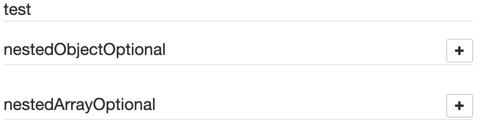
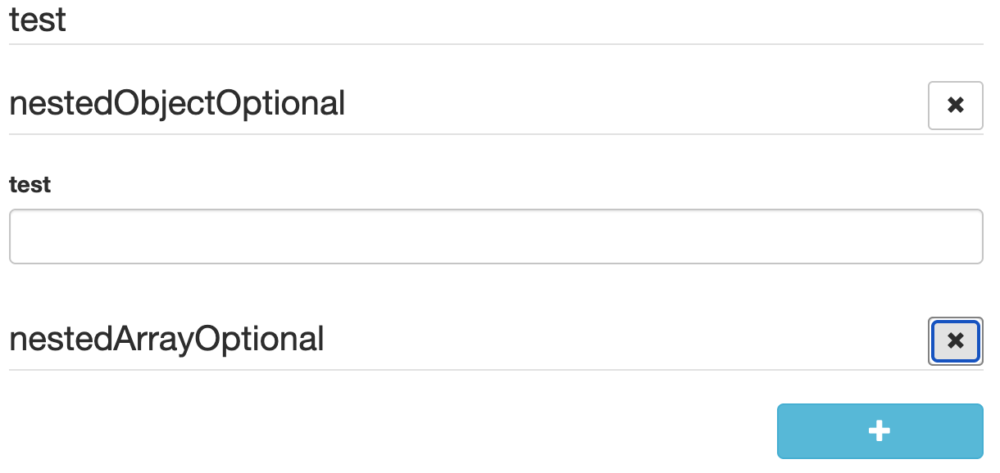

# uiSchema

JSON Schema is limited for describing how a given data type should be rendered as a form input component. That's why this library introduces the concept of uiSchema.

A UI schema is basically an object literal providing information on **how** the form should be rendered, while the JSON schema tells **what**.

The uiSchema object follows the tree structure of the form field hierarchy, and defines how each property should be rendered.

Note that almost every property within uiSchema can be rendered in one of two ways: `{"ui:options": {[property]: [value]}}`, or `{"ui:[property]": value}`.

In other words, the following `uiSchema`s are equivalent:

```json
{
  "ui:title": "Title",
  "ui:description": "Description",
  "ui:classNames": "my-class",
  "ui:submitButtonOptions": {
    "props": {
      "disabled": false,
      "className": "btn btn-info"
    },
    "norender": false,
    "submitText": "Submit"
  }
}
```

```json
{
  "ui:options": {
    "title": "Title",
    "description": "Description",
    "classNames": "my-class",
    "submitButtonOptions": {
      "props": {
        "disabled": false,
        "className": "btn btn-info"
      },
      "norender": false,
      "submitText": "Submit"
    }
  }
}
```

For a full list of what is supported in the `uiSchema` see the `UiSchema` type in [@rjsf/utils/types.ts](https://github.com/rjsf-team/react-jsonschema-form/blob/main/packages/utils/src/types.ts).
Be sure to pay attention to the hierarchical intersection to these other types: `UIOptionsBaseType` and `TemplatesType`.

## Exceptions to the equivalence

There are 4 properties that exist in a `UiSchema` that will not be found in an inner `ui:options` object.

### ui:globalOptions

The set of globally relevant `UiSchema` options that are read from the root-level `UiSchema` and stored in the `registry` for use everywhere.

```ts
import { UiSchema } from '@rjsf/utils';

const uiSchema: UiSchema = {
  'ui:globalOptions': { copyable: true },
};
```

### ui:rootFieldId (deprecated)

> DEPRECATED: Use `Form.idPrefix` instead, will be removed in a future major version

By default, this library will generate ids unique to the form for all rendered widgets.
If you plan on using multiple instances of the `Form` component in a same page, it's wise to declare a root prefix for these, using the `ui:rootFieldId` uiSchema directive:

```ts
import { UiSchema } from '@rjsf/utils';

const uiSchema: UiSchema = {
  'ui:rootFieldId': 'myform',
};
```

This will make all widgets have an id prefixed with `myform`.

### ui:field

The `ui:field` property overrides the `Field` implementation used for rendering any field in the form's hierarchy.
Specify either the name of a field that is used to look up an implementation from the `fields` list or an actual one-off `Field` component implementation itself.

See [Custom Widgets and Fields](../advanced-customization/custom-widgets-fields.md#custom-field-components) for more information about how to use this property.

### ui:fieldReplacesAnyOrOneOf

By default, any field that is rendered for an `anyOf`/`oneOf` schema will be wrapped inside the `AnyOfField` or `OneOfField` component.
This default behavior may be undesirable if your custom field already handles behavior related to choosing one or more subschemas contained in the `anyOf`/`oneOf` schema.
By providing a `true` value for this flag in association with a custom `ui:field`, the wrapped components will be omitted, so just one instance of the custom field will be rendered.
If the flag is omitted or set to `false`, your custom field will be wrapped by `AnyOfField`/`OneOfField`.

### ui:options

The `ui:options` property cannot be nested inside itself and thus is the last exception.

## ui:XXX or ui:options.XXX

All the properties that follow can be specified in the `uiSchema` in either of the two equivalent ways.

> NOTE: The properties specific to array items can be found [here](../json-schema/arrays.md#array-item-uiSchema-options). For advanced dynamic UI schema capabilities for array items, see the [Dynamic UI Schema Examples](./dynamic-ui-schema-examples.md).

### widget

The `ui:widget` property overrides the `Widget` implementation used for rendering any field in the form's hierarchy.
Specify either the name of a widget that is used to look up an implementation from the `widgets` list or an actual one-off `Widget` component implementation itself.

See [Custom Widgets and Fields](../advanced-customization/custom-widgets-fields.md) for more information about how to use this property.

### classNames

The uiSchema object accepts a `ui:classNames` property for each field of the schema:

```tsx
import { UiSchema } from '@rjsf/utils';

const uiSchema = {
  title: {
    'ui:classNames': 'task-title foo-bar',
  },
};
```

Will result in:

```html
<div class="field field-string task-title foo-bar">
  <label>
    <span>Title*</span>
    <input value="My task" required="" type="text" />
  </label>
</div>
```

### style

The uiSchema object accepts a `ui:style` property for each field of the schema:

```tsx
import { UiSchema } from '@rjsf/utils';

const uiSchema = {
  title: {
    'ui:style': { color: 'red' },
  },
};
```

Will result in:

```html
<div class="field field-string task-title" style={{ color: "red" }}>
  <label>
    <span>Title*</span>
    <input value="My task" required="" type="text">
  </label>
</div>
```

### autocomplete

If you want to mark a text input, select or textarea input to use the HTML autocomplete feature, set the `ui:autocomplete` uiSchema directive to a valid [HTML autocomplete value](https://developer.mozilla.org/en-US/docs/Web/HTML/Attributes/autocomplete#values).

```tsx
import { RJSFSchema, UiSchema } from '@rjsf/utils';

const schema: RJSFSchema = { type: 'string' };
const uiSchema: UiSchema = {
  'ui:widget': 'textarea',
  'ui:autocomplete': 'on',
};
```

### autofocus

If you want to automatically focus on a text input or textarea input, set the `ui:autofocus` uiSchema directive to `true`.

```tsx
import { RJSFSchema, UiSchema } from '@rjsf/utils';

const schema: RJSFSchema = { type: 'string' };
const uiSchema: UiSchema = {
  'ui:widget': 'textarea',
  'ui:autofocus': true,
};
```

### description

Sometimes it's convenient to change the description of a field. This is the purpose of the `ui:description` uiSchema directive:

```tsx
import { RJSFSchema, UiSchema } from '@rjsf/utils';

const schema: RJSFSchema = { type: 'string' };
const uiSchema: UiSchema = {
  'ui:widget': 'password',
  'ui:description': 'The best password',
};
```

### disabled

The `ui:disabled` uiSchema directive will disable all child widgets from a given field.

> Note: If you're wondering about the difference between a `disabled` field and a `readonly` one: Marking a field as read-only will render it greyed out, but its text value will be selectable. Disabling it will prevent its value to be selected at all.

### enableMarkdownInDescription

The `ui:enableMarkdownInDescription` uiSchema directive enables the support of Markdown syntax within the description of
a field.

```tsx
import { Form } from '@rjsf/core';
import { RJSFSchema, UiSchema } from '@rjsf/utils';
import validator from '@rjsf/validator-ajv8';

const schema: RJSFSchema = { type: 'string', description: '**bolded** text in the description' };
const uiSchema: UiSchema = {
  'ui:enableMarkdownInDescription': true,
};
render(<Form schema={schema} uiSchema={uiSchema} validator={validator} />, document.getElementById('app'));
```

It can also be enabled globally by setting the `enableMarkdownInDescription` option to `true` in the `ui:globalOptions`
uiSchema directive.

```tsx
import { Form } from '@rjsf/core';
import { RJSFSchema, UiSchema } from '@rjsf/utils';
import validator from '@rjsf/validator-ajv8';

const schema: RJSFSchema = { type: 'string', description: '**bolded** text in the description' };
const uiSchema: UiSchema = {
  'ui:globalOptions': {
    enableMarkdownInDescription: true,
  },
};

render(<Form schema={schema} uiSchema={uiSchema} validator={validator} />, document.getElementById('app'));
```

### enableMarkdownInHelp

The `ui:enableMarkdownInHelp` uiSchema directive enables the support of Markdown syntax within the help displayed for
a field.

```tsx
import { Form } from '@rjsf/core';
import { RJSFSchema, UiSchema } from '@rjsf/utils';
import validator from '@rjsf/validator-ajv8';

const schema: RJSFSchema = { type: 'string' };
const uiSchema: UiSchema = {
  'ui:enableMarkdownInHelp': true,
  'ui:help': '**bolded** text in the help',
};
render(<Form schema={schema} uiSchema={uiSchema} validator={validator} />, document.getElementById('app'));
```

It can also be enabled globally by setting the `enableMarkdownInHelp` option to `true` in the `ui:globalOptions`
uiSchema directive.

```tsx
import { Form } from '@rjsf/core';
import { RJSFSchema, UiSchema } from '@rjsf/utils';
import validator from '@rjsf/validator-ajv8';

const schema: RJSFSchema = { type: 'string' };
const uiSchema: UiSchema = {
  'ui:globalOptions': {
    enableMarkdownInHelp: true,
  },
  'ui:help': '**bolded** text in the help',
};

render(<Form schema={schema} uiSchema={uiSchema} validator={validator} />, document.getElementById('app'));
```

### enableOptionalDataFieldForType

The `ui:enableOptionalDataFieldForType` uiSchema directive enables support for displaying the `Optional Data Controls` feature.
The intention of this feature is to allow developers to provide a condensed UI for users who don't care to enter an optional list of array items or set of optional object fields (see [examples](#add-optional-data-controls) below).

This directive takes, as its value, an array in one of four forms:

1. `[]` - Disables the feature at a global or field level
2. `['array']` - Enables the feature only for optional arrays at a global or field level
3. `['object']` - Enables the feature only for optional object at a global or field level
4. `['array', 'object']`- Enables the feature for both optional object and arrays at a global or field level

It can be specified in either the `ui:globalOptions` to turn the feature on for everything or in a specific field's `uiSchema`
To work properly this option must be coupled with the [emptyObjectFields](./form-props.md#emptyobjectfields) experimental feature on `Form` using the `populateRequiredDefaults` or `skipDefaults` options.

When enabled for either (or both) the `array` or `object` types, any optional object or array field which has an "undefined" value in `formData` will NOT render any of the container's UI elements.
Instead the object/array container's field title will have an "Add optional data" icon button that, when clicked will cause an empty container data element to be added to `formData`.

When enabled for either (or both) the `array` or `object` types, any optional object or array field which has an "defined" value in `formData` will render all of the container's UI elements as normal AND the object/array container's field title will have a "Remove optional data" icon button that, when clicked will set the data for field in the `formData` to "undefined".

Here is an example of what the UI will look like when enabled using the following `Form` configuration:

```tsx
const schema: RJSFSchema = {
  title: 'test',
  properties: {
    nestedObjectOptional: {
      type: 'object',
      properties: {
        test: {
          type: 'string',
        },
      },
    },
    nestedArrayOptional: {
      type: 'array',
      items: {
        type: 'string',
      },
    },
  },
};
const uiSchema = {
  'ui:globalOptions': {
    enableOptionalDataFieldForType: ['object', 'array'],
  },
};
const experimental_defaultFormStateBehavior = {
  // Set the emptyObjectFields to only populate required defaults to highlight the code working
  emptyObjectFields: 'populateRequiredDefaults',
};

render(
  <Form
    schema={schema}
    validator={validator}
    uiSchema={uiSchema}
    experimental_defaultFormStateBehavior={experimental_defaultFormStateBehavior}
    templates={{ OptionalDataControlsTemplate }}
  />,
  document.getElementById('app'),
);
```

#### Add Optional Data Controls



#### Remove Optional Data Controls



### emptyValue

The `ui:emptyValue` uiSchema directive provides the default value to use when an input for a field is empty

### enumDisabled

To disable an option, use the `enumDisabled` property in uiSchema.

```tsx
import { RJSFSchema, UiSchema } from '@rjsf/utils';

const schema: RJSFSchema = {
  type: 'string',
  enum: ['one', 'two', 'three'],
};

const uiSchema: UiSchema = {
  'ui:enumDisabled': ['two'],
};
```

### enumNames

Allows a user to provide a list of labels for enum values in the schema.

```tsx
import { RJSFSchema, UiSchema } from '@rjsf/utils';

const schema: RJSFSchema = {
  type: 'number',
  enum: [1, 2, 3],
};
const uiSchema: UiSchema = {
  'ui:enumNames': ['one', 'two', 'three'],
};
```

### filePreview

The `FileWidget` can be configured to show a preview of an image or a download link for non-images using this flag.

```tsx
import { RJSFSchema, UiSchema } from '@rjsf/utils';

const schema: RJSFSchema = {
  type: 'string',
  format: 'data-url',
};
const uiSchema: UiSchema = {
  'ui:options': {
    filePreview: true,
  },
};
```

### help

Sometimes it's convenient to add text next to a field to guide the end user filling it. This is the purpose of the `ui:help` uiSchema directive:

```tsx
import { RJSFSchema, UiSchema } from '@rjsf/utils';

const schema: RJSFSchema = { type: 'string' };
const uiSchema: UiSchema = {
  'ui:widget': 'password',
  'ui:help': 'Hint: Make it strong!',
};
```


Help texts work for any kind of field at any level, and will always be rendered immediately below the field component widget(s) (after contextualized errors, if any).

### hideError

The `ui:hideError` uiSchema directive will, if set to `true`, hide the default error display for the given field AND all of its child fields in the hierarchy.

If you need to enable the default error display of a child in the hierarchy after setting `hideError: true` on the parent field, simply set `hideError: false` on the child.

This is useful when you have a custom field or widget that utilizes either the `rawErrors` or the `errorSchema` to manipulate and/or show the error(s) for the field/widget itself.

### inputType

To change the input type (for example, `tel` or `email`) you can specify the `inputType` in the `ui:options` uiSchema directive.

```tsx
import { RJSFSchema, UiSchema } from '@rjsf/utils';

const schema: RJSFSchema = { type: 'string' };
const uiSchema: UiSchema = {
  'ui:options': {
    inputType: 'tel',
  },
};
```

### label

Field labels are rendered by default.
Labels may be omitted on a per-field by setting the `label` option to `false` in the `ui:options` uiSchema directive.

```tsx
import { Form } from '@rjsf/core';
import { RJSFSchema, UiSchema } from '@rjsf/utils';
import validator from '@rjsf/validator-ajv8';

const schema: RJSFSchema = { type: 'string' };
const uiSchema: UiSchema = {
  'ui:options': {
    label: false,
  },
};

render(<Form schema={schema} uiSchema={uiSchema} validator={validator} />, document.getElementById('app'));
```

They can also be omitted globally by setting the `label` option to `false` in the `ui:globalOptions` uiSchema directive.

```tsx
import { Form } from '@rjsf/core';
import { RJSFSchema, UiSchema } from '@rjsf/utils';
import validator from '@rjsf/validator-ajv8';

const schema: RJSFSchema = { type: 'string' };
const uiSchema: UiSchema = {
  'ui:globalOptions': {
    label: false,
  },
};

render(<Form schema={schema} uiSchema={uiSchema} validator={validator} />, document.getElementById('app'));
```

### order

This property allows you to reorder the properties that are shown for a particular object. See [Objects](../json-schema/objects.md) for more information.

### placeholder

You can add placeholder text to an input by using the `ui:placeholder` uiSchema directive:

```tsx
import { Form } from '@rjsf/core';
import { RJSFSchema, UiSchema } from '@rjsf/utils';
import validator from '@rjsf/validator-ajv8';

const schema: RJSFSchema = { type: 'string', format: 'uri' };
const uiSchema: UiSchema = {
  'ui:placeholder': 'http://',
};

render(<Form schema={schema} uiSchema={uiSchema} validator={validator} />, document.getElementById('app'));
```

Fields using `enum` can also use `ui:placeholder`. The value will be used as the text for the empty option in the select widget.

```tsx
import { Form } from '@rjsf/core';
import { RJSFSchema, UiSchema } from '@rjsf/utils';
import validator from '@rjsf/validator-ajv8';

const schema: RJSFSchema = { type: 'string', enum: ['First', 'Second'] };
const uiSchema: UiSchema = {
  'ui:placeholder': 'Choose an option',
};

render(<Form schema={schema} uiSchema={uiSchema} validator={validator} />, document.getElementById('app'));
```

### readonly

The `ui:readonly` uiSchema directive will mark all child widgets from a given field as read-only. This is equivalent to setting the `readOnly` property in the schema.

> Note: If you're wondering about the difference between a `disabled` field and a `readonly` one: Marking a field as read-only will render it greyed out, but its text value will be selectable. Disabling it will prevent its value to be selected at all.

### rows

You can set the initial height of a textarea widget by specifying `rows` option.

```tsx
import { Form } from '@rjsf/core';
import { RJSFSchema, UiSchema } from '@rjsf/utils';
import validator from '@rjsf/validator-ajv8';

const schema: RJSFSchema = { type: 'string' };
const uiSchema: UiSchema = {
  'ui:options': {
    widget: 'textarea',
    rows: 15,
  },
};

render(<Form schema={schema} uiSchema={uiSchema} validator={validator} />, document.getElementById('app'));
```

### title

Sometimes it's convenient to change a field's title. This is the purpose of the `ui:title` uiSchema directive:

```tsx
import { RJSFSchema, UiSchema } from '@rjsf/utils';

const schema: RJSFSchema = { type: 'string' };
const uiSchema: UiSchema = {
  'ui:widget': 'password',
  'ui:title': 'Your password',
};
```

### submitButtonOptions

Sometimes it's convenient to change the behavior of the submit button for the form. This is the purpose of the `ui:submitButtonOptions` uiSchema directive:

You can pass any other prop to the submit button if you want, by default, this library will set the following options / props mentioned below for all submit buttons:

#### `norender` option

You can set this property to `true` to remove the submit button completely from the form. Nice option, if the form is just for viewing purposes.

#### `submitText` option

You can use this option to change the text of the submit button. Set to "Submit" by default.

#### `props` section

You can pass any other prop to the submit button if you want, via this section.

##### `disabled` prop

You can use this option to disable the submit button.

##### `className` prop

You can use this option to specify a class name for the submit button.

```tsx
import { UiSchema } from '@rjsf/utils';

const uiSchema: UiSchema = {
  'ui:submitButtonOptions': {
    props: {
      disabled: false,
      className: 'btn btn-info',
    },
    norender: false,
    submitText: 'Submit',
  },
};
```

## `duplicateKeySuffixSeparator` option

When using `additionalProperties`, key collision is prevented by appending a unique integer suffix to the duplicate key.
For example, when you add a key named `myKey` to a form where `myKey` is already defined, then your new key will become `myKey-1`.
You can use `ui:duplicateKeySuffixSeparator` to override the default separator, `"-"` with a string of your choice on a per-field basis.

You can also set this in the `ui:globalOptions` to have the same separator used everywhere.

```ts
import { UiSchema } from '@rjsf/utils';

const uiSchema = {
  'ui:globalOptions': {
    duplicateKeySuffixSeparator: '_',
  },
};
```

## Using uiSchema with oneOf, anyOf

### anyOf

The uiSchema will work with elements inside an `anyOf` as long as the uiSchema defines the `anyOf` key at the same level as the `anyOf` within the `schema`.
Because the `anyOf` in the `schema` is an array, so must be the one in the `uiSchema`.
If you want to override the titles of the first two elements within the `anyOf` list you would do the following:

```ts
import { RJSFSchema, UiSchema } from '@rjsf/utils';

const schema: RJSFSchema = {
  type: 'object',
  anyOf: [
    {
      title: 'Strings',
      type: 'string',
    },
    {
      title: 'Numbers',
      type: 'number',
    },
    {
      title: 'Booleans',
      type: 'boolean',
    },
  ],
};

const uiSchema: UiSchema = {
  anyOf: [
    {
      'ui:title': 'Custom String Title',
    },
    {
      'ui:title': 'Custom Number Title',
    },
  ],
};
```

> NOTE: Because the third element in the `schema` does not have an associated element in the `uiSchema`, it will keep its original title.

### oneOf

The uiSchema will work with elements inside an `oneOf` as long as the uiSchema defines the `oneOf` key at the same level as the `oneOf` within the `schema`.
Because the `oneOf` in the `schema` is an array, so must be the one in the `uiSchema`.
If you want to override the titles of the first two elements within the `oneOf` list you would do the following:

```ts
import { RJSFSchema, UiSchema } from '@rjsf/utils';

const schema: RJSFSchema = {
  type: 'object',
  oneOf: [
    {
      title: 'Strings',
      type: 'string',
    },
    {
      title: 'Numbers',
      type: 'number',
    },
    {
      title: 'Booleans',
      type: 'boolean',
    },
  ],
};

const uiSchema: UiSchema = {
  oneOf: [
    {
      'ui:title': 'Custom String Title',
    },
    {
      'ui:title': 'Custom Number Title',
    },
  ],
};
```

> NOTE: Because the third element in the `schema` does not have an associated element in the `uiSchema`, it will keep its original title.

## Theme Options

- [AntD Customization](themes/antd/uiSchema.md)
- [Chakra-UI Customization](themes/chakra-ui/uiSchema.md)
- [PrimeReact Customization](themes/primereact/uiSchema.md)
- [Semantic-UI Customization](themes/semantic-ui/uiSchema.md)
