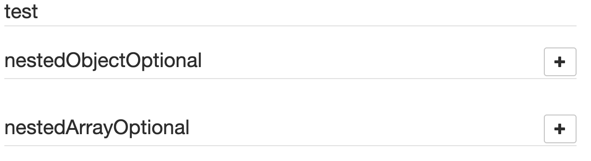
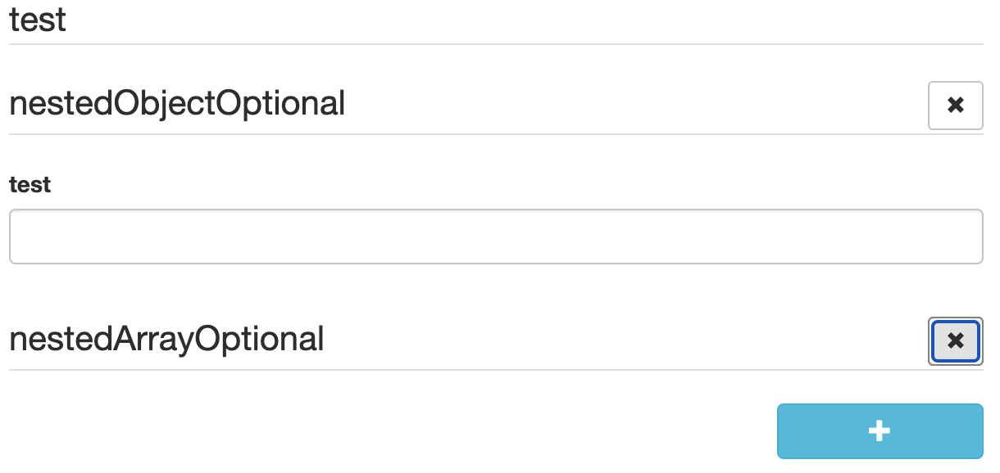

# uiSchema

JSON Schema is limited for describing how a given data type should be rendered as a form input component. That's why this library introduces the concept of uiSchema.

A UI schema is basically an object literal providing information on **how** the form should be rendered, while the JSON schema tells **what**.

The uiSchema object follows the tree structure of the form field hierarchy, and defines how each property should be rendered.

Note that almost every property within uiSchema can be rendered in one of two ways: `{"ui:options": {[property]: [value]}}`, or `{"ui:[property]": value}`.

In other words, the following `uiSchema`s are equivalent:

```json
{
  "ui:title": "Title",
  "ui:description": "Description",
  "ui:classNames": "my-class",
  "ui:submitButtonOptions": {
    "props": {
      "disabled": false,
      "className": "btn btn-info"
    },
    "norender": false,
    "submitText": "Submit"
  }
}
```

```json
{
  "ui:options": {
    "title": "Title",
    "description": "Description",
    "classNames": "my-class",
    "submitButtonOptions": {
      "props": {
        "disabled": false,
        "className": "btn btn-info"
      },
      "norender": false,
      "submitText": "Submit"
    }
  }
}
```

For a full list of what is supported in the `uiSchema` see the `UiSchema` type in [@rjsf/utils/types.ts](https://github.com/rjsf-team/react-jsonschema-form/blob/main/packages/utils/src/types.ts).
Be sure to pay attention to the hierarchical intersection to these other types: `UIOptionsBaseType` and `TemplatesType`.

## Exceptions to the equivalence

There are 4 properties that exist in a `UiSchema` that will not be found in an inner `ui:options` object.

### `ui:globalOptions`

The set of globally relevant `UiSchema` options that are read from the root-level `UiSchema` and stored in the `registry` for use everywhere.

```ts
import { UiSchema } from '@rjsf/utils';

const uiSchema: UiSchema = {
  'ui:globalOptions': { copyable: true },
};
```

### `ui:definitions` {#ui-definitions}

The `ui:definitions` property allows you to define reusable UI customizations for schema `$ref` references. This is particularly useful for:

- **Recursive schemas** - Define uiSchema once for a self-referencing schema node
- **Reused definitions** - Apply consistent UI to schemas used in multiple places
- **oneOf/anyOf branches** - Provide different uiSchema for branches that reference different definitions

The keys in `ui:definitions` must match the exact `$ref` path used in the schema (e.g., `#/definitions/address` or `#/$defs/node`).

```tsx
import { Form } from '@rjsf/core';
import { RJSFSchema, UiSchema } from '@rjsf/utils';
import validator from '@rjsf/validator-ajv8';

const schema: RJSFSchema = {
  definitions: {
    address: {
      type: 'object',
      properties: {
        street_address: { type: 'string' },
        city: { type: 'string' },
      },
    },
    node: {
      type: 'object',
      properties: {
        name: { type: 'string' },
        children: {
          type: 'array',
          items: { $ref: '#/definitions/node' }, // Recursive reference
        },
      },
    },
  },
  type: 'object',
  properties: {
    billing_address: { $ref: '#/definitions/address' },
    shipping_address: { $ref: '#/definitions/address' },
    tree: { $ref: '#/definitions/node' },
  },
};

const uiSchema: UiSchema = {
  'ui:definitions': {
    '#/definitions/address': {
      street_address: { 'ui:placeholder': 'Street and number' },
      city: { 'ui:placeholder': 'City name' },
    },
    '#/definitions/node': {
      name: { 'ui:placeholder': 'Enter node name' },
      children: { 'ui:options': { orderable: false } },
    },
  },
  // Local overrides take precedence over ui:definitions
  shipping_address: {
    street_address: { 'ui:placeholder': 'Shipping street (overrides definition)' },
  },
};

render(<Form schema={schema} uiSchema={uiSchema} validator={validator} />, document.getElementById('app'));
```

#### Local Overrides

You can override specific properties from `ui:definitions` by providing values at the field path. Local values are merged with definitions, with local values taking precedence.

#### oneOf/anyOf with Same Property Names

When using `oneOf` or `anyOf` with branches that have properties with the same name, each branch's `$ref` maps to its own entry in `ui:definitions`, ensuring correct UI is applied:

```tsx
const schema: RJSFSchema = {
  definitions: {
    person: { type: 'object', properties: { name: { type: 'string' } } },
    company: { type: 'object', properties: { name: { type: 'string' } } },
  },
  type: 'object',
  properties: {
    contact: {
      oneOf: [
        { title: 'Person', $ref: '#/definitions/person' },
        { title: 'Company', $ref: '#/definitions/company' },
      ],
    },
  },
};

const uiSchema: UiSchema = {
  'ui:definitions': {
    '#/definitions/person': {
      name: { 'ui:placeholder': 'Full name (e.g., John Doe)' },
    },
    '#/definitions/company': {
      name: { 'ui:placeholder': 'Company name (e.g., Acme Inc.)' },
    },
  },
};
```

### `ui:field`

The `ui:field` property overrides the `Field` implementation used for rendering any field in the form's hierarchy.
Specify either the name of a field that is used to look up an implementation from the `fields` list or an actual one-off `Field` component implementation itself.

See [Custom Widgets and Fields](../advanced-customization/custom-widgets-fields.md#custom-field-components) for more information about how to use this property.

### `ui:fieldReplacesAnyOrOneOf`

By default, any field that is rendered for an `anyOf`/`oneOf` schema will be wrapped inside the `AnyOfField` or `OneOfField` component.
This default behavior may be undesirable if your custom field already handles behavior related to choosing one or more subschemas contained in the `anyOf`/`oneOf` schema.
By providing a `true` value for this flag in association with a custom `ui:field`, the wrapped components will be omitted, so just one instance of the custom field will be rendered.
If the flag is omitted or set to `false`, your custom field will be wrapped by `AnyOfField`/`OneOfField`.

### `ui:options`

The `ui:options` property cannot be nested inside itself and thus is the last exception.

## `ui:XXX` or `ui:options.XXX`

All the properties that follow can be specified in the `uiSchema` in either of the two equivalent ways.

> NOTE: The properties specific to array items can be found [here](../json-schema/arrays.md#array-item-uiSchema-options). For advanced dynamic UI schema capabilities for array items, see the [Dynamic UI Schema Examples](./dynamic-ui-schema-examples.md).

### widget

The `ui:widget` property overrides the `Widget` implementation used for rendering any field in the form's hierarchy.
Specify either the name of a widget that is used to look up an implementation from the `widgets` list or an actual one-off `Widget` component implementation itself.

See [Custom Widgets and Fields](../advanced-customization/custom-widgets-fields.md) for more information about how to use this property.

### classNames

The uiSchema object accepts a `ui:classNames` property for each field of the schema:

```tsx
import { UiSchema } from '@rjsf/utils';

const uiSchema = {
  title: {
    'ui:classNames': 'task-title foo-bar',
  },
};
```

Will result in:

```html
<div class="field field-string task-title foo-bar">
  <label>
    <span>Title*</span>
    <input value="My task" required="" type="text" />
  </label>
</div>
```

### style

The uiSchema object accepts a `ui:style` property for each field of the schema:

```tsx
import { UiSchema } from '@rjsf/utils';

const uiSchema = {
  title: {
    'ui:style': { color: 'red' },
  },
};
```

Will result in:

```html
<div class="field field-string task-title" style={{ color: "red" }}>
  <label>
    <span>Title*</span>
    <input value="My task" required="" type="text">
  </label>
</div>
```

### allowClearTextInputs

The optional `ui:allowClearTextInputs` uiSchema directive enables a clear/reset button for text-based input widgets.
When set to true, a clear button will be displayed when the input field has a value and is not readonly or disabled.
When omitted, no clear button will be displayed for text input fields.

When clicked, the property value will be set to the `ui:emptyValue`, if defined.

```tsx
import { RJSFSchema, UiSchema } from '@rjsf/utils';
const schema: RJSFSchema = { type: 'string' };
const uiSchema: UiSchema = {
  'ui:allowClearTextInputs': true,
};
```

It can also be enabled globally by setting the `allowClearTextInputs` option to `true` in the `ui:globalOptions`
uiSchema directive.

```tsx
import { Form } from '@rjsf/core';
import { RJSFSchema, UiSchema } from '@rjsf/utils';
import validator from '@rjsf/validator-ajv8';

const schema: RJSFSchema = { type: 'string' };
const uiSchema: UiSchema = {
  'ui:globalOptions': {
    allowClearTextInputs: true,
  },
};
```

### autocomplete

If you want to mark a text input, select or textarea input to use the HTML autocomplete feature, set the `ui:autocomplete` uiSchema directive to a valid [HTML autocomplete value](https://developer.mozilla.org/en-US/docs/Web/HTML/Attributes/autocomplete#values).

```tsx
import { RJSFSchema, UiSchema } from '@rjsf/utils';

const schema: RJSFSchema = { type: 'string' };
const uiSchema: UiSchema = {
  'ui:widget': 'textarea',
  'ui:autocomplete': 'on',
};
```

### autocapitalize

To control automatic capitalization on virtual keyboards for a text input, set the `ui:autocapitalize` uiSchema
directive to a valid [HTML autocapitalize value](https://developer.mozilla.org/en-US/docs/Web/HTML/Global_attributes/autocapitalize#value).

```tsx
import { RJSFSchema, UiSchema } from '@rjsf/utils';

const schema: RJSFSchema = { type: 'string' };
const uiSchema: UiSchema = {
  'ui:autocapitalize': 'words',
};
```

### autofocus

If you want to automatically focus on a text input or textarea input, set the `ui:autofocus` uiSchema directive to `true`.

```tsx
import { RJSFSchema, UiSchema } from '@rjsf/utils';

const schema: RJSFSchema = { type: 'string' };
const uiSchema: UiSchema = {
  'ui:widget': 'textarea',
  'ui:autofocus': true,
};
```

### description

Sometimes it's convenient to change the description of a field. This is the purpose of the `ui:description` uiSchema directive:

```tsx
import { RJSFSchema, UiSchema } from '@rjsf/utils';

const schema: RJSFSchema = { type: 'string' };
const uiSchema: UiSchema = {
  'ui:widget': 'password',
  'ui:description': 'The best password',
};
```

### deprecatedHandling

The `ui:deprecatedHandling` uiSchema directive controls how a field marked as `deprecated` in the JSON Schema is rendered.

Accepts one of three values:

- `'label'` (default): The field is rendered normally with `"(deprecated)"` appended to its label.
- `'disable'`: The field is rendered but all its child widgets are disabled.
- `'hide'`: The field is completely hidden from the form.

```tsx
import { RJSFSchema, UiSchema } from '@rjsf/utils';

const schema: RJSFSchema = {
  type: 'object',
  properties: {
    legacyField: { type: 'string', deprecated: true },
  },
};

const uiSchema: UiSchema = {
  legacyField: {
    'ui:options': {
      deprecatedHandling: 'disable',
    },
  },
};
```

It can also be set globally by specifying the `deprecatedHandling` option in the `ui:globalOptions` uiSchema directive, which applies the chosen behavior to every deprecated field in the form.

```tsx
import { Form } from '@rjsf/core';
import { RJSFSchema, UiSchema } from '@rjsf/utils';
import validator from '@rjsf/validator-ajv8';

const schema: RJSFSchema = {
  type: 'object',
  properties: {
    legacyField: { type: 'string', deprecated: true },
    anotherOldField: { type: 'number', deprecated: true },
  },
};

const uiSchema: UiSchema = {
  'ui:globalOptions': {
    deprecatedHandling: 'hide',
  },
};

render(<Form schema={schema} uiSchema={uiSchema} validator={validator} />, document.getElementById('app'));
```

### disabled

The `ui:disabled` uiSchema directive will disable all child widgets from a given field.

> Note: If you're wondering about the difference between a `disabled` field and a `readonly` one: Marking a field as read-only will render it greyed out, but its text value will be selectable. Disabling it will prevent its value to be selected at all.

### enableMarkdownInDescription

The `ui:enableMarkdownInDescription` uiSchema directive enables the support of Markdown syntax within the description of
a field. It renders through the registered [`MarkdownTemplate`](../advanced-customization/custom-templates.md#markdowntemplate),
whose core default is plain text, so a renderer has to be registered as well — `@rjsf/core/markdown` provides one and
needs `markdown-to-jsx` installed.

```tsx
import { Form } from '@rjsf/core';
import MarkdownTemplate from '@rjsf/core/markdown';
import { RJSFSchema, UiSchema } from '@rjsf/utils';
import validator from '@rjsf/validator-ajv8';

const schema: RJSFSchema = { type: 'string', description: '**bolded** text in the description' };
const uiSchema: UiSchema = {
  'ui:enableMarkdownInDescription': true,
};
render(
  <Form schema={schema} uiSchema={uiSchema} validator={validator} templates={{ MarkdownTemplate }} />,
  document.getElementById('app'),
);
```

It can also be enabled globally by setting the `enableMarkdownInDescription` option to `true` in the `ui:globalOptions`
uiSchema directive.

```tsx
import { Form } from '@rjsf/core';
import MarkdownTemplate from '@rjsf/core/markdown';
import { RJSFSchema, UiSchema } from '@rjsf/utils';
import validator from '@rjsf/validator-ajv8';

const schema: RJSFSchema = { type: 'string', description: '**bolded** text in the description' };
const uiSchema: UiSchema = {
  'ui:globalOptions': {
    enableMarkdownInDescription: true,
  },
};

render(
  <Form schema={schema} uiSchema={uiSchema} validator={validator} templates={{ MarkdownTemplate }} />,
  document.getElementById('app'),
);
```

### enableMarkdownInHelp

The `ui:enableMarkdownInHelp` uiSchema directive enables the support of Markdown syntax within the help displayed for
a field. Like `ui:enableMarkdownInDescription`, it renders through the registered
[`MarkdownTemplate`](../advanced-customization/custom-templates.md#markdowntemplate) and needs a renderer registered.

```tsx
import { Form } from '@rjsf/core';
import MarkdownTemplate from '@rjsf/core/markdown';
import { RJSFSchema, UiSchema } from '@rjsf/utils';
import validator from '@rjsf/validator-ajv8';

const schema: RJSFSchema = { type: 'string' };
const uiSchema: UiSchema = {
  'ui:enableMarkdownInHelp': true,
  'ui:help': '**bolded** text in the help',
};
render(
  <Form schema={schema} uiSchema={uiSchema} validator={validator} templates={{ MarkdownTemplate }} />,
  document.getElementById('app'),
);
```

It can also be enabled globally by setting the `enableMarkdownInHelp` option to `true` in the `ui:globalOptions`
uiSchema directive.

```tsx
import { Form } from '@rjsf/core';
import MarkdownTemplate from '@rjsf/core/markdown';
import { RJSFSchema, UiSchema } from '@rjsf/utils';
import validator from '@rjsf/validator-ajv8';

const schema: RJSFSchema = { type: 'string' };
const uiSchema: UiSchema = {
  'ui:globalOptions': {
    enableMarkdownInHelp: true,
  },
  'ui:help': '**bolded** text in the help',
};

render(
  <Form schema={schema} uiSchema={uiSchema} validator={validator} templates={{ MarkdownTemplate }} />,
  document.getElementById('app'),
);
```

### enableOptionalDataFieldForType

The `ui:enableOptionalDataFieldForType` uiSchema directive enables support for displaying the `Optional Data Controls` feature.
The intention of this feature is to allow developers to provide a condensed UI for users who don't care to enter an optional list of array items or set of optional object fields (see [examples](#add-optional-data-controls) below).

This directive takes, as its value, an array in one of four forms:

1. `[]` - Disables the feature at a global or field level
2. `['array']` - Enables the feature only for optional arrays at a global or field level
3. `['object']` - Enables the feature only for optional object at a global or field level
4. `['array', 'object']`- Enables the feature for both optional object and arrays at a global or field level

It can be specified in either the `ui:globalOptions` to turn the feature on for everything or in a specific field's `uiSchema`
To work properly this option must be coupled with the [emptyObjectFields](./form-props.md#emptyobjectfields) experimental feature on `Form` using the `populateRequiredDefaults` or `skipDefaults` options.

When enabled for either (or both) the `array` or `object` types, any optional object or array field which has an "undefined" value in `formData` will NOT render any of the container's UI elements.
Instead the object/array container's field title will have an "Add optional data" icon button that, when clicked will cause an empty container data element to be added to `formData`.

When enabled for either (or both) the `array` or `object` types, any optional object or array field which has an "defined" value in `formData` will render all of the container's UI elements as normal AND the object/array container's field title will have a "Remove optional data" icon button that, when clicked will set the data for field in the `formData` to "undefined".

Here is an example of what the UI will look like when enabled using the following `Form` configuration:

```tsx
const schema: RJSFSchema = {
  title: 'test',
  properties: {
    nestedObjectOptional: {
      type: 'object',
      properties: {
        test: {
          type: 'string',
        },
      },
    },
    nestedArrayOptional: {
      type: 'array',
      items: {
        type: 'string',
      },
    },
  },
};
const uiSchema = {
  'ui:globalOptions': {
    enableOptionalDataFieldForType: ['object', 'array'],
  },
};
const defaultFormStateBehavior = {
  // Set the emptyObjectFields to only populate required defaults to highlight the code working
  emptyObjectFields: 'populateRequiredDefaults',
};

render(
  <Form
    schema={schema}
    validator={validator}
    uiSchema={uiSchema}
    defaultFormStateBehavior={defaultFormStateBehavior}
    templates={{ OptionalDataControlsTemplate }}
  />,
  document.getElementById('app'),
);
```

#### Add Optional Data Controls



#### Remove Optional Data Controls



### emptyValue

The `ui:emptyValue` uiSchema directive provides the value to store whenever a field is blank — whether it was emptied by typing, by clicking the `ui:allowClearTextInputs` clear button, was never filled in on initial render, or is blank again after a form reset. It defaults to `undefined`, which omits the field from the form data entirely.

> Note: because it now populates untouched fields too, `ui:emptyValue` can change what validation reports for a field the user never interacted with. A non-empty `emptyValue` (e.g. `''`) can trip a schema constraint the field would otherwise never see — `minLength`, `pattern`, `format`, or an `enum` that doesn't include that value — on an optional field. On a schema-required field, it has the opposite effect: an `emptyValue` present from the first render satisfies `required` even though the user never entered anything, so pair it with a schema constraint (like `minLength`) if an effectively-empty value shouldn't be allowed to pass as complete.
>
> Note: for array items, the plain-object and array (per-tuple-position) forms of `uiSchema.items` are both applied when computing defaults (including a `minItems` filler item or a new row added via the array's "Add" button, which uses `uiSchema.additionalItems` instead when it's added past a fixed/tuple `items` schema); the dynamic `(itemData, index, formContext) => UiSchema` function form can't be resolved before there's item data to call it with, so it's ignored for that purpose (it still works normally for rendering existing items).

### enumDisabled

To disable an option, use the `enumDisabled` property in uiSchema.

```tsx
import { RJSFSchema, UiSchema } from '@rjsf/utils';

const schema: RJSFSchema = {
  type: 'string',
  enum: ['one', 'two', 'three'],
};

const uiSchema: UiSchema = {
  'ui:enumDisabled': ['two'],
};
```

### enumNames

Allows a user to provide labels for enum values in the schema. Can be an array (matched by index) or a map (matched by value).

```tsx
import { RJSFSchema, UiSchema } from '@rjsf/utils';

const schema: RJSFSchema = {
  type: 'number',
  enum: [1, 2, 3],
};

// Array form (matched by index)
const uiSchemaArray: UiSchema = {
  'ui:enumNames': ['one', 'two', 'three'],
};

// Map form (matched by value)
const uiSchemaMap: UiSchema = {
  'ui:enumNames': { 1: 'one', 2: 'two', 3: 'three' },
};
```

### enumOrder

Controls the display order of enum options. Use `'*'` to represent remaining values in their original schema order. Unlisted values not covered by `'*'` are dropped.

```tsx
import { RJSFSchema, UiSchema } from '@rjsf/utils';

const schema: RJSFSchema = {
  type: 'string',
  enum: ['apple', 'banana', 'cherry', 'date'],
};

const uiSchema: UiSchema = {
  'ui:enumOrder': ['cherry', '*', 'apple'],
};
```

### filePreview

The `FileWidget` can be configured to show a preview of an image or a download link for non-images using this flag.

```tsx
import { RJSFSchema, UiSchema } from '@rjsf/utils';

const schema: RJSFSchema = {
  type: 'string',
  format: 'data-url',
};
const uiSchema: UiSchema = {
  'ui:options': {
    filePreview: true,
  },
};
```

### help

Sometimes it's convenient to add text next to a field to guide the end user filling it. This is the purpose of the `ui:help` uiSchema directive:

```tsx
import { RJSFSchema, UiSchema } from '@rjsf/utils';

const schema: RJSFSchema = { type: 'string' };
const uiSchema: UiSchema = {
  'ui:widget': 'password',
  'ui:help': 'Hint: Make it strong!',
};
```


Help texts work for any kind of field at any level, and will always be rendered immediately below the field component widget(s) (after contextualized errors, if any).

### hideError

The `ui:hideError` uiSchema directive will, if set to `true`, hide the default error display for the given field AND all of its child fields in the hierarchy.

If you need to enable the default error display of a child in the hierarchy after setting `hideError: true` on the parent field, simply set `hideError: false` on the child.

This is useful when you have a custom field or widget that utilizes either the `rawErrors` or the `errorSchema` to manipulate and/or show the error(s) for the field/widget itself.

### initialValue

The `ui:initialValue` uiSchema directive pre-fills a field on initial render and after a form reset. It takes priority over `schema.default`, but never overrides form data that has already been provided. This is useful for a field, often hidden, that a particular form wants to fix to a known value without changing the underlying schema:

```tsx
import { RJSFSchema, UiSchema } from '@rjsf/utils';

const schema: RJSFSchema = {
  type: 'object',
  properties: {
    country: { type: 'string' },
  },
};

const uiSchema: UiSchema = {
  country: {
    'ui:widget': 'hidden',
    'ui:initialValue': 'US',
  },
};
```

> Note: `ui:initialValue` is applied as an ordinary default, the same way `schema.default` is, so it comes back after the field is cleared (`onChange` storing `undefined` re-triggers default computation, which reapplies it) rather than leaving the field genuinely empty. If a field needs to be clearable, pair `ui:initialValue` with a distinct [`ui:emptyValue`](#emptyvalue) rather than relying on it alone.
>
> The same [array-items caveat as `ui:emptyValue`](#emptyvalue) applies to array items too.

### inputType

To change the input type (for example, `tel` or `email`) you can specify the `inputType` in the `ui:options` uiSchema directive.

```tsx
import { RJSFSchema, UiSchema } from '@rjsf/utils';

const schema: RJSFSchema = { type: 'string' };
const uiSchema: UiSchema = {
  'ui:options': {
    inputType: 'tel',
  },
};
```

### label

Field labels are rendered by default.
Labels may be omitted on a per-field by setting the `label` option to `false` in the `ui:options` uiSchema directive.

```tsx
import { Form } from '@rjsf/core';
import { RJSFSchema, UiSchema } from '@rjsf/utils';
import validator from '@rjsf/validator-ajv8';

const schema: RJSFSchema = { type: 'string' };
const uiSchema: UiSchema = {
  'ui:options': {
    label: false,
  },
};

render(<Form schema={schema} uiSchema={uiSchema} validator={validator} />, document.getElementById('app'));
```

They can also be omitted globally by setting the `label` option to `false` in the `ui:globalOptions` uiSchema directive.

```tsx
import { Form } from '@rjsf/core';
import { RJSFSchema, UiSchema } from '@rjsf/utils';
import validator from '@rjsf/validator-ajv8';

const schema: RJSFSchema = { type: 'string' };
const uiSchema: UiSchema = {
  'ui:globalOptions': {
    label: false,
  },
};

render(<Form schema={schema} uiSchema={uiSchema} validator={validator} />, document.getElementById('app'));
```

### optgroups

To group a `select`-backed widget's options into labeled sections (rendered as `<optgroup>` elements, or each theme's closest equivalent), specify the grouping via the `optgroups` key in `ui:options`.
Keys are the group labels, values are arrays of enum values belonging to that group.
Any enum values not listed in a group are rendered ungrouped after the groups. This is supported by every `@rjsf` theme package.

A value in a group matches the enum entry it is equal to.
Primitive values also match by their string form, the same way `ui:enumOrder` does, so `'1'` groups the enum value `1`.
Object and array enum values can't be grouped from a JSON-authored uiSchema, since a value only matches that very same object.
Values that match no enum entry are ignored, and a group with no matching entries is not rendered.
`ui:enumDisabled`, which often sits beside `optgroups` in the same `ui:options` block, does not share that string-form fallback — it matches enum values strictly.
So for the enum `[1, 2, 3]`, `{ enumDisabled: ['2'], optgroups: { Low: ['1', '2'] } }` groups `2` but leaves it selectable; write the enum's own value (`2`) in `enumDisabled`.

Groups render in the object's property order. JavaScript always places integer-like keys (such as `'2024'`) first, in ascending numeric order, ahead of every other key no matter where they were written.
So `{ Newest: [...], '2024': [...], '2023': [...] }` renders as `2023`, `2024`, `Newest`.
To keep numeric labels in the order you wrote them, make them non-integer strings (for example `'Year 2024'`).

Grouping is purely presentational and never changes what a form submits.
A `multiple` select reports its selected values in whatever order it would have reported them in without `optgroups`, so adding, reordering or removing a group leaves the order of the submitted array alone.
That underlying order is the theme's own: `@rjsf/core` and `@rjsf/react-bootstrap` render a native `<select>`, which exposes no selection order at all, so they report enum order; the themes built on a custom dropdown track the selection themselves and order it their own way.

Each theme groups with whatever primitive its UI library provides, so the accessible semantics vary slightly.
The one caveat worth knowing is `@rjsf/mui`: MUI's `Select` clones every child of its list with `role="option"` and offers no group primitive, so group labels are rendered as `ListSubheader`s marked `aria-disabled` — announced, but not offered as selectable choices.
A consequence worth knowing when writing tests: in `@rjsf/mui`, and only there, a query like `getAllByRole('option')` counts the group labels alongside the real options.

```tsx
import { Form } from '@rjsf/core';
import { RJSFSchema, UiSchema } from '@rjsf/utils';
import validator from '@rjsf/validator-ajv8';

const schema: RJSFSchema = {
  type: 'string',
  enum: ['lorem', 'ipsum', 'dolorem', 'alpha', 'beta', 'gamma'],
};

const uiSchema: UiSchema = {
  'ui:options': {
    optgroups: {
      Latin: ['lorem', 'ipsum', 'dolorem'],
      Greek: ['alpha', 'beta', 'gamma'],
    },
  },
};

render(<Form schema={schema} uiSchema={uiSchema} validator={validator} />, document.getElementById('app'));
```

### optionValueFormat

Controls how enum-backed widgets (`select`, `radio`, `checkboxes`) encode option values in their DOM `value` attributes. Accepts `'indexed'` (default) or `'realValue'`.

- `'indexed'`: options are encoded as their array index (e.g. `value="0"`, `value="1"`). This is the historical behavior and keeps non-primitive enum values (objects, arrays) addressable without stringifying them.
- `'realValue'`: primitive option values are stringified directly (e.g. `value="admin"`, `value="42"`, `value="true"`). This enables native HTML form submission and browser autocomplete since the submitted value matches the enum value. Non-primitive values (objects, arrays) still fall back to their index because `String(obj)` would produce `"[object Object]"`.

The form data passed to `onChange` is always the typed enum value; this option only affects the DOM-level encoding. Can be specified in `ui:globalOptions` to apply to all enum-backed fields, or per-field in `ui:options`.

```tsx
import { Form } from '@rjsf/core';
import { RJSFSchema, UiSchema } from '@rjsf/utils';
import validator from '@rjsf/validator-ajv8';

const schema: RJSFSchema = {
  type: 'object',
  properties: {
    role: { type: 'string', enum: ['admin', 'editor', 'viewer'] },
  },
};

// Form-wide
const uiSchema: UiSchema = {
  'ui:globalOptions': {
    optionValueFormat: 'realValue',
  },
};

// Or per-field
const fieldUiSchema: UiSchema = {
  role: {
    'ui:options': {
      optionValueFormat: 'realValue',
    },
  },
};

render(<Form schema={schema} uiSchema={uiSchema} validator={validator} />, document.getElementById('app'));
```

### order

This property allows you to reorder the properties that are shown for a particular object. See [Objects](../json-schema/objects.md) for more information.

### placeholder

You can add placeholder text to an input by using the `ui:placeholder` uiSchema directive:

```tsx
import { Form } from '@rjsf/core';
import { RJSFSchema, UiSchema } from '@rjsf/utils';
import validator from '@rjsf/validator-ajv8';

const schema: RJSFSchema = { type: 'string', format: 'uri' };
const uiSchema: UiSchema = {
  'ui:placeholder': 'http://',
};

render(<Form schema={schema} uiSchema={uiSchema} validator={validator} />, document.getElementById('app'));
```

Fields using `enum` can also use `ui:placeholder`. The value will be used as the text for the empty option in the select widget.

```tsx
import { Form } from '@rjsf/core';
import { RJSFSchema, UiSchema } from '@rjsf/utils';
import validator from '@rjsf/validator-ajv8';

const schema: RJSFSchema = { type: 'string', enum: ['First', 'Second'] };
const uiSchema: UiSchema = {
  'ui:placeholder': 'Choose an option',
};

render(<Form schema={schema} uiSchema={uiSchema} validator={validator} />, document.getElementById('app'));
```

### readonly

The `ui:readonly` uiSchema directive will mark all child widgets from a given field as read-only. This is equivalent to setting the `readOnly` property in the schema.

> Note: If you're wondering about the difference between a `disabled` field and a `readonly` one: Marking a field as read-only will render it greyed out, but its text value will be selectable. Disabling it will prevent its value to be selected at all.

### required

The `ui:required` uiSchema directive overrides a field's `required` status on the UI side only. Setting it to `true` shows the required indicator and adds the field to the effective required set used for validation, even if the schema doesn't mark it required. Setting it to `false` hides the required indicator on a schema-required field, but does **not** suppress schema-level validation — if the field is left empty, validation still fails.

Because of that, `ui:required: false` is only useful alongside `ui:initialValue` or `ui:emptyValue`, which guarantee the field always has a value. If it's used on a schema-required field without either, a `console.warn` is emitted, since the UI would show the field as optional while validation still rejects an empty value:

```tsx
import { RJSFSchema, UiSchema } from '@rjsf/utils';

const schema: RJSFSchema = {
  type: 'object',
  required: ['country'],
  properties: {
    country: { type: 'string' },
    nickname: { type: 'string' },
  },
};

const uiSchema: UiSchema = {
  country: {
    'ui:widget': 'hidden',
    'ui:initialValue': 'US',
    'ui:required': false, // hidden and pre-filled, no need to show as required
  },
  nickname: {
    'ui:required': true, // required in this form, even though the schema doesn't say so
  },
};
```

`ui:required` must be set per field; it is **not** honored when set via `ui:globalOptions`. Unlike most global options, it also has to be seen by schema validation (which only ever looks at a field's own uiSchema), so a form-wide default would make the required indicator and validation disagree.

`ui:required` is enforced by walking the form the same way it's rendered — resolving each node's schema (`$ref`, `allOf`, `dependencies`, `if`/`then`/`else`, the selected `oneOf`/`anyOf` branch) and uiSchema (including a [`ui:definitions`](#ui-definitions) fragment) against the current `formData`, exactly as `SchemaField` does. Because of that, it's enforced everywhere a field can appear — nested objects, array items, a `ui:definitions` fragment, a field only reachable through `dependencies`/`$ref`/`allOf`, and inside the currently-selected `oneOf`/`anyOf` branch — on both the submit and `liveValidate` paths, and by precompiled validators (which never see the schema mutated, since it isn't). Under `liveValidate`, a change to `uiSchema` or `formContext` alone doesn't re-validate: if `ui:required` depends on state outside the form, the error appears on the next data change, blur or submit.

The one difference worth knowing: a `ui:required` error is built by RJSF itself, not by your validator, so it has a `property` and `message` but not a validator-specific shape (e.g. AJV's `params.missingProperty`/`schemaPath`), and it does not pass through a custom `transformErrors` function the way schema-level errors do. It renders under the field and participates in `focusOnFirstError` normally, worded identically to a schema-level required error (`must have required property 'x'`) so it reads the same in an error list.

A known limitation under `oneOf`/`anyOf`: which branch is "selected" is picked by matching `formData` against each option's schema, the same way `MultiSchemaField` picks its initial branch. `MultiSchemaField` then keeps the user's own selection in component state, independent of that matching, so once the `formData` for the field no longer disambiguates the options (e.g. it's empty, or matches more than one branch equally well), a manual switch between options can leave the enforced branch out of sync with the one actually rendered — a `ui:required` error can appear for a field that isn't shown, or fail to appear for one that is. This can't be fixed from outside the rendered form, since the walk that enforces `ui:required` has no access to `MultiSchemaField`'s component state. It only arises when the data itself doesn't distinguish the branches; giving each option a distinguishing property (e.g. a `const`-valued discriminator field) avoids it entirely.

### rows

You can set the initial height of a textarea widget by specifying `rows` option.

```tsx
import { Form } from '@rjsf/core';
import { RJSFSchema, UiSchema } from '@rjsf/utils';
import validator from '@rjsf/validator-ajv8';

const schema: RJSFSchema = { type: 'string' };
const uiSchema: UiSchema = {
  'ui:options': {
    widget: 'textarea',
    rows: 15,
  },
};

render(<Form schema={schema} uiSchema={uiSchema} validator={validator} />, document.getElementById('app'));
```

### title

Sometimes it's convenient to change a field's title. This is the purpose of the `ui:title` uiSchema directive:

```tsx
import { RJSFSchema, UiSchema } from '@rjsf/utils';

const schema: RJSFSchema = { type: 'string' };
const uiSchema: UiSchema = {
  'ui:widget': 'password',
  'ui:title': 'Your password',
};
```

### submitButtonOptions

Sometimes it's convenient to change the behavior of the submit button for the form. This is the purpose of the `ui:submitButtonOptions` uiSchema directive:

You can pass any other prop to the submit button if you want, by default, this library will set the following options / props mentioned below for all submit buttons:

#### `norender` option

You can set this property to `true` to remove the submit button completely from the form. Nice option, if the form is just for viewing purposes.

#### `submitText` option

You can use this option to change the text of the submit button. Set to "Submit" by default.

#### `props` section

You can pass any other prop to the submit button if you want, via this section.

##### `disabled` prop

You can use this option to disable the submit button.

##### `className` prop

You can use this option to specify a class name for the submit button.

```tsx
import { UiSchema } from '@rjsf/utils';

const uiSchema: UiSchema = {
  'ui:submitButtonOptions': {
    props: {
      disabled: false,
      className: 'btn btn-info',
    },
    norender: false,
    submitText: 'Submit',
  },
};
```

## `duplicateKeySuffixSeparator` option

When using `additionalProperties`, key collision is prevented by appending a unique integer suffix to the duplicate key.
For example, when you add a key named `myKey` to a form where `myKey` is already defined, then your new key will become `myKey-1`.
You can use `ui:duplicateKeySuffixSeparator` to override the default separator, `"-"` with a string of your choice on a per-field basis.

You can also set this in the `ui:globalOptions` to have the same separator used everywhere.

```ts
import { UiSchema } from '@rjsf/utils';

const uiSchema = {
  'ui:globalOptions': {
    duplicateKeySuffixSeparator: '_',
  },
};
```

## Using uiSchema with oneOf, anyOf

### anyOf

The uiSchema will work with elements inside an `anyOf` as long as the uiSchema defines the `anyOf` key at the same level as the `anyOf` within the `schema`.
Because the `anyOf` in the `schema` is an array, so must be the one in the `uiSchema`.
If you want to override the titles of the first two elements within the `anyOf` list you would do the following:

```ts
import { RJSFSchema, UiSchema } from '@rjsf/utils';

const schema: RJSFSchema = {
  type: 'object',
  anyOf: [
    {
      title: 'Strings',
      type: 'string',
    },
    {
      title: 'Numbers',
      type: 'number',
    },
    {
      title: 'Booleans',
      type: 'boolean',
    },
  ],
};

const uiSchema: UiSchema = {
  anyOf: [
    {
      'ui:title': 'Custom String Title',
    },
    {
      'ui:title': 'Custom Number Title',
    },
  ],
};
```

> NOTE: Because the third element in the `schema` does not have an associated element in the `uiSchema`, it will keep its original title.

### oneOf

The uiSchema will work with elements inside an `oneOf` as long as the uiSchema defines the `oneOf` key at the same level as the `oneOf` within the `schema`.
Because the `oneOf` in the `schema` is an array, so must be the one in the `uiSchema`.
If you want to override the titles of the first two elements within the `oneOf` list you would do the following:

```ts
import { RJSFSchema, UiSchema } from '@rjsf/utils';

const schema: RJSFSchema = {
  type: 'object',
  oneOf: [
    {
      title: 'Strings',
      type: 'string',
    },
    {
      title: 'Numbers',
      type: 'number',
    },
    {
      title: 'Booleans',
      type: 'boolean',
    },
  ],
};

const uiSchema: UiSchema = {
  oneOf: [
    {
      'ui:title': 'Custom String Title',
    },
    {
      'ui:title': 'Custom Number Title',
    },
  ],
};
```

> NOTE: Because the third element in the `schema` does not have an associated element in the `uiSchema`, it will keep its original title.

## Theme Options

- [AntD Customization](themes/antd/uiSchema.md)
- [Chakra-UI Customization](themes/chakra-ui/uiSchema.md)
- [MUI Customization](themes/mui/uiSchema.md)

## Type-safe UiSchema

`UiSchema<T>` checks that a nested key names a real field of `T` (see the [v7 upgrade guide](../migration-guides/v7.x%20upgrade%20guide.md#uischemat-checks-field-names-breaking-change)), but by default it does not check the _values_ given to a field's `ui:widget`/`ui:field`/`ui:options` against that field's type - a widget name that doesn't apply to the field it's on (`{ 'ui:widget': 'RangeWidget' }` on a `string` field), or a typo in a `ui:`-prefixed option name (`ui:wigdet`), still only surfaces at runtime, if at all.

`UiSchema` takes a fourth, opt-in type parameter, `Checks`, that closes that gap. Pass a `Checks` union and `UiSchema` narrows `ui:widget`, `ui:field` and `ui:options` (and their `ui:`-prefixed equivalents, e.g. `ui:placeholder`) to only the values valid for each field's form-data type, recursing into nested objects/arrays the same way. `@rjsf/utils` itself has no widgets of its own, so it has no vocabulary to pass - each theme exports its own `Checks` union next to its widgets; `@rjsf/core` exports `CoreUiOptionsChecks`, describing its own built-in widget/field/option vocabulary:

```ts
import type { CoreUiOptionsChecks } from '@rjsf/core';
import type { FormContextType, RJSFSchema, UiSchema } from '@rjsf/utils';

interface FormData {
  age: number;
  bio: string;
}

const uiSchema: UiSchema<FormData, RJSFSchema, FormContextType, CoreUiOptionsChecks> = {
  age: { 'ui:widget': 'RangeWidget' }, // ok - RangeWidget is valid for `number`
  bio: {
    // @ts-expect-error RangeWidget is not valid for a `string` field
    'ui:widget': 'RangeWidget',
  },
};
```

Passing `Checks` is entirely opt-in, and can be adopted incrementally, field by field or form by form - `UiSchema<T>` with no fourth argument behaves exactly as it always has (fully open, no narrowing).

### Extending the widget/option vocabulary

The widget/field names and options a `Checks` union declares are built from `UiOptionsCheck<When, Then>` rules: "when a field's type is assignable to `When`, the names/options in `Then` become valid for it." Extend a built-in vocabulary - `@rjsf/core`'s `CoreUiOptionsChecks`, or a theme's own equivalent - by unioning in your own `UiOptionsCheck` entries, not by modifying or augmenting that export itself. `Checks` is also never included automatically - union it in yourself with whatever else you want to add:

```ts
import type { CoreUiOptionsChecks } from '@rjsf/core';
import type { FormContextType, RJSFSchema, UiOptionsCheck, UiSchema } from '@rjsf/utils';

type MyThemeChecks = UiOptionsCheck<boolean, { widget?: 'ToggleWidget' }>;
type MyUiSchema<T = any> = UiSchema<T, RJSFSchema, FormContextType, CoreUiOptionsChecks | MyThemeChecks>;

const uiSchema: MyUiSchema<{ active: boolean }> = {
  active: { 'ui:widget': 'ToggleWidget' },
};
```

### Known gaps

- With no form-data type (`T` defaulting to `any`), a closed `UiSchema` does **not** fall back to unrestricted strings for `ui:widget`/`ui:field` - they're still limited to the names declared in `Checks`. Pass an actual widget/field component instance instead of a string, or extend `Checks`, for anything not already covered.
- A field whose form-data shape includes an index signature (e.g. from `additionalProperties`/`patternProperties`) only gets type-checking for its explicitly-declared keys; dynamic keys are type-checked but without narrowing beyond the index signature's value type.

### Applying it to an inline uiSchema with `satisfies`

Declaring an intermediate `const uiSchema: UiSchema<FormData, RJSFSchema, FormContextType, CoreUiOptionsChecks> = {...}` and passing that to `Form`'s `uiSchema` prop gets you the narrowing above, because `FormProps['uiSchema']` is typed as the open `UiSchema<T, S, F>` (no `Checks`), which is permissive enough to accept a well-formed closed value with no cast. An inline `uiSchema` object literal passed directly as a JSX prop, though, is checked against that same open type and gets no narrowing at all - check it against the closed form with TypeScript's `satisfies` operator instead. `satisfies` validates the expression while leaving the expression's own type in place for the surrounding `uiSchema` prop, so no intermediate variable or cast is needed:

```tsx
<Form
  schema={schema}
  uiSchema={
    {
      // Compile error: RangeWidget is not valid for `bio`, a string field.
      bio: { 'ui:widget': 'RangeWidget' },
    } satisfies UiSchema<FormData, RJSFSchema, FormContextType, CoreUiOptionsChecks>
  }
  validator={validator}
/>
```
