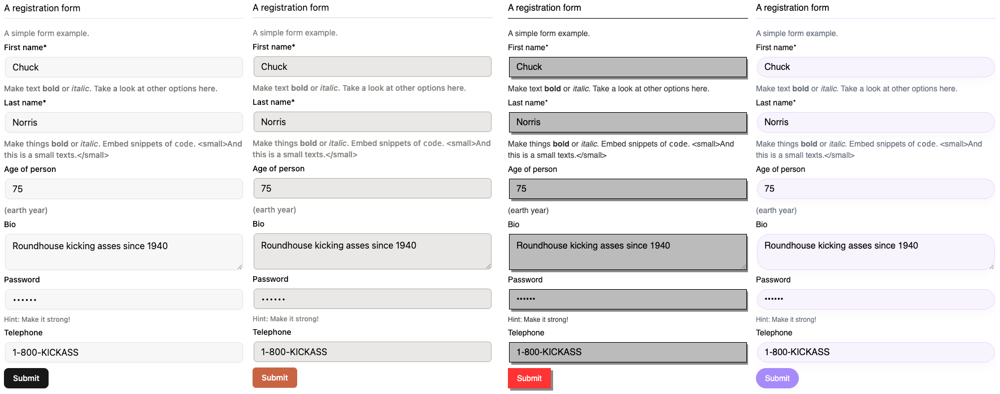

<!-- PROJECT LOGO -->
<br />
<p align="center">
  <a href="https://github.com/rjsf-team/react-jsonschema-form">
    
  </a>

<h3 align="center">@rjsf/shadcn</h3>

  <p align="center">
  Shadcn theme, fields and widgets for <a href="https://github.com/mozilla-services/react-jsonschema-form/"><code>react-jsonschema-form</code></a>.
    <br />
    <a href="https://rjsf-team.github.io/react-jsonschema-form/docs/"><strong>Explore the docs »</strong></a>
    <br />
    <br />
   <a href="https://rjsf-team.github.io/react-jsonschema-form/">View Playground</a>
    ·
    <a href="https://github.com/rjsf-team/react-jsonschema-form/issues">Report Bug</a>
    ·
    <a href="https://github.com/rjsf-team/react-jsonschema-form/issues">Request Feature</a>
  </p>

<!-- TABLE OF CONTENTS -->

## Table of Contents

- [Table of Contents](#table-of-contents)
- [About The Project](#about-the-project)
    - [Built With](#built-with)
- [Getting Started](#getting-started)
    - [Prerequisites](#prerequisites)
    - [Installation](#installation)
- [Usage](#usage)
- [Contributing](#contributing)
- [Contact](#contact)

<!-- ABOUT THE PROJECT -->

## About The Project

Exports `shadcn` theme, fields and widgets for `react-jsonschema-form`.

[](https://rjsf-team.github.io/@rjsf/shadcn)

[Live demo](https://react-jsonschema-form-shadcn-boilerplate.vercel.app/)

### Built With

- [react-jsonschema-form](https://github.com/mozilla-services/react-jsonschema-form/)
- [shadcn](https://ui.shadcn.com/)
- [Typescript](https://www.typescriptlang.org/)

<!-- GETTING STARTED -->

## Getting Started

### Prerequisites

- `@rjsf/core >= 6`
- `@rjsf/utils >= 6`
- `@rjsf/validator-ajv8 >= 6`

```bash
yarn add @rjsf/core @rjsf/utils @rjsf/validator-ajv8
```

### Installation

```bash
yarn add @rjsf/shadcn
```

## Usage

```js
import Form from '@rjsf/shadcn';
```

or

```js
import {withTheme} from '@rjsf/core';
import {Theme as shadcnTheme} from '@rjsf/shadcn';

const Form = withTheme(shadcnTheme);
```

<!-- THEMING -->

## Theming

### Using Tailwind

Follow shadCN installation guide [here](https://ui.shadcn.com/docs/installation) for your application

The color of the RJSF will automatically apply with your shadCN config.

#### Tailwind v3
Add the following line to your tailwind.config.ts
```typescript
  content: [
    "./src/**/*.{html,js}",
    "node_modules/@rjsf/shadcn/src/**/*.{js,ts,jsx,tsx,mdx}" // Add this line
  ],
```
#### Tailwind v4
Add the following line to your equivalent global.css
```css
@source "../node_modules/@rjsf/shadcn";
```

### Not using Tailwind

#### Use the theme on demo site

All shadcn's default color theme are included in the npm packages. Simply do

```
import '@rjsf/shadcn/dist/[color].css';
e.g:
import '@rjsf/shadcn/dist/zinc.css';
```

Supported colors are:

- default
- zinc
- red
- rose
- orange
- green
- blue
- yellow
- violet

#### Coloring

- Generate a theme from [official shadCN site](https://ui.shadcn.com/themes)
  or  [tweakcn](https://tweakcn.com/editor/theme)
- Navigate to shadcn/css, create a new file called [your-theme].css
- Replace the base layer code with your new color
- Follow the next section to build your CSS file

#### Build your CSS file

If you are not using tailwind but still wants to use this theme, you can follow these steps:

- Clone the repository

```
cd packages/shadcn
npm i
npm run build:css
```

- Include the built file in /dist/rjsf-shadcn.css in your application

## Dark mode (Tailwind only)

Check out this section by [shadCN](https://ui.shadcn.com/docs/dark-mode)

## RTL (Tailwind only)

### Installation

```bash
npm install @radix-ui/react-direction --save
```

### Implementation

1. Wrap your layout with DirectionProvider:

    ```tsx
    import {DirectionProvider as RadixDirectionProvider} from '@radix-ui/react-direction;
    
    function Layout({children, direction}) {
        return (
            <RadixDirectionProvider dir={direction}>
                {children}
            </RadixDirectionProvider>
        );
    }
    ```

2. Set HTML direction attribute:

    ```html
    <html dir="rtl" lang="en">
    ```

3. You can refer to `direction-context.tsx`, `direction-provider.tsx` and `rtl-toggle.tsx` from demo repository for
   implementation.

## Updating to latest shadCN version

- Simply copy the shadcn components into shadcn/src/components/ui and rebuilt the packages or using the shadcn CLI at
  the root level with the components.json
- For RTL version, you might need component from [here](https://github.com/shadcn-ui/ui/pull/1638)
  by [nahasco](https://github.com/nahasco)
- [Fancy multi-select](https://craft.mxkaske.dev/post/fancy-multi-select)

<!-- CONTRIBUTING -->

## Contributing

Read our [contributors' guide](https://rjsf-team.github.io/react-jsonschema-form/docs/contributing/) to get started.

<!-- CONTACT -->

## Contact

rjsf team: [https://github.com/orgs/rjsf-team/people](https://github.com/orgs/rjsf-team/people)

GitHub
repository: [https://github.com/rjsf-team/react-jsonschema-form](https://github.com/rjsf-team/react-jsonschema-form)

<!-- MARKDOWN LINKS & IMAGES -->
<!-- https://www.markdownguide.org/basic-syntax/#reference-style-links -->

[build-shield]: https://github.com/rjsf-team/react-jsonschema-form/workflows/CI/badge.svg

[build-url]: https://github.com/rjsf-team/react-jsonschema-form/actions

[contributors-shield]: https://img.shields.io/github/contributors/rjsf-team/react-jsonschema-form.svg

[contributors-url]: https://github.com/rjsf-team/react-jsonschema-form/graphs/contributors

[license-shield]: https://img.shields.io/badge/license-Apache%202.0-blue.svg?style=flat-square

[license-url]: https://choosealicense.com/licenses/apache-2.0/

[npm-shield]: https://img.shields.io/npm/v/@rjsf/shadcn/latest.svg?style=flat-square

[npm-url]: https://www.npmjs.com/package/@rjsf/shadcn

[npm-dl-shield]: https://img.shields.io/npm/dm/@rjsf/shadcn.svg?style=flat-square

[npm-dl-url]: https://www.npmjs.com/package/@rjsf/shadcn

[product-screenshot]: https://raw.githubusercontent.com/rjsf-team/react-jsonschema-form/59a8206e148474bea854bbb004f624143fbcbac8/packages/shadcn/screenshot.png
