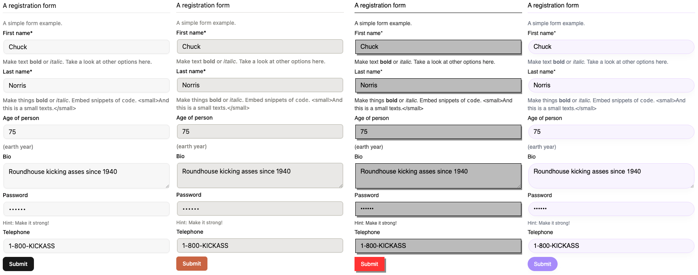

<!-- PROJECT LOGO -->
<br />
<p align="center">
  <a href="https://github.com/rjsf-team/react-jsonschema-form">
    
  </a>

<h3 align="center">@rjsf/shadcn</h3>

  <p align="center">
  Shadcn theme, fields and widgets for <a href="https://github.com/mozilla-services/react-jsonschema-form/"><code>react-jsonschema-form</code></a>.
    <br />
    <a href="https://rjsf-team.github.io/react-jsonschema-form/docs/"><strong>Explore the docs »</strong></a>
    <br />
    <br />
   <a href="https://rjsf-team.github.io/react-jsonschema-form/">View Playground</a>
    ·
    <a href="https://github.com/rjsf-team/react-jsonschema-form/issues">Report Bug</a>
    ·
    <a href="https://github.com/rjsf-team/react-jsonschema-form/issues">Request Feature</a>
  </p>

<!-- TABLE OF CONTENTS -->

## Table of Contents

- [Table of Contents](#table-of-contents)
- [About The Project](#about-the-project)
    - [Built With](#built-with)
- [Getting Started](#getting-started)
    - [Prerequisites](#prerequisites)
    - [Installation](#installation)
- [Usage](#usage)
- [Contributing](#contributing)
- [Contact](#contact)

<!-- ABOUT THE PROJECT -->

## About The Project

Exports `shadcn` theme, fields and widgets for `react-jsonschema-form`.

[](https://rjsf-team.github.io/@rjsf/shadcn)

[Live demo](https://react-jsonschema-form-shadcn-boilerplate.vercel.app/)

### Built With

- [react-jsonschema-form](https://github.com/mozilla-services/react-jsonschema-form/)
- [shadcn](https://ui.shadcn.com/)
- [Typescript](https://www.typescriptlang.org/)

<!-- GETTING STARTED -->

## Getting Started

### Prerequisites

- `@rjsf/core >= 6`
- `@rjsf/utils >= 6`
- `@rjsf/validator-ajv8 >= 6`

```bash
yarn add @rjsf/core @rjsf/utils @rjsf/validator-ajv8
```

### Installation

```bash
yarn add @rjsf/shadcn
```

## Usage

```js
import Form from '@rjsf/shadcn';
```

or

```js
import {withTheme} from '@rjsf/core';
import {Theme as shadcnTheme} from '@rjsf/shadcn';

const Form = withTheme(shadcnTheme);
```

<!-- THEMING -->

## Theming

`@rjsf/shadcn` ships no stylesheet. Like shadcn itself, it is styled by your application's Tailwind build and by the
CSS variables your application defines, so the form picks up your colors, radius, fonts and dark mode automatically.

### Tailwind

Set up Tailwind v4 and shadcn in your application by following the
[shadcn installation guide](https://ui.shadcn.com/docs/installation), then tell Tailwind to scan this package for
class names by adding a `@source` line to the CSS file that imports Tailwind:

```css
@import "tailwindcss";
@source "../node_modules/@rjsf/shadcn/lib";
```

Tailwind skips `node_modules` unless a path is opted in explicitly. The path is relative to the CSS file, so adjust
it to where that file lives. With pnpm the package may be a symlink into the store; if the classes do not appear,
point `@source` at the resolved path or use `@tailwindcss/vite`, which follows the symlink.

### CSS variables

The components use the standard shadcn variables — `--background`, `--foreground`, `--primary`,
`--primary-foreground`, `--secondary`, `--muted`, `--accent`, `--destructive`, `--border`, `--input`, `--ring`,
`--radius` and their `-foreground` counterparts — through the `@theme inline` mapping that `shadcn init` writes into
your global CSS. Any theme generated by [shadcn themes](https://ui.shadcn.com/themes) or
[tweakcn](https://tweakcn.com/editor/theme) works as is; the
[playground](https://rjsf-team.github.io/react-jsonschema-form/) demonstrates several.

## Dark mode

Check out this section by [shadCN](https://ui.shadcn.com/docs/dark-mode)

## RTL

### Installation

```bash
npm install @radix-ui/react-direction --save
```

### Implementation

1. Wrap your layout with DirectionProvider:

    ```tsx
    import {DirectionProvider as RadixDirectionProvider} from '@radix-ui/react-direction;
    
    function Layout({children, direction}) {
        return (
            <RadixDirectionProvider dir={direction}>
                {children}
            </RadixDirectionProvider>
        );
    }
    ```

2. Set HTML direction attribute:

    ```html
    <html dir="rtl" lang="en">
    ```

3. You can refer to `direction-context.tsx`, `direction-provider.tsx` and `rtl-toggle.tsx` from demo repository for
   implementation.

## Updating to latest shadCN version

- Simply copy the shadcn components into shadcn/src/components/ui and rebuilt the packages or using the shadcn CLI at
  the root level with the components.json
- For RTL version, you might need component from [here](https://github.com/shadcn-ui/ui/pull/1638)
  by [nahasco](https://github.com/nahasco)
- [Fancy multi-select](https://craft.mxkaske.dev/post/fancy-multi-select)

<!-- CONTRIBUTING -->

## Contributing

Read our [contributors' guide](https://rjsf-team.github.io/react-jsonschema-form/docs/contributing/) to get started.

<!-- CONTACT -->

## Contact

rjsf team: [https://github.com/orgs/rjsf-team/people](https://github.com/orgs/rjsf-team/people)

GitHub
repository: [https://github.com/rjsf-team/react-jsonschema-form](https://github.com/rjsf-team/react-jsonschema-form)

<!-- MARKDOWN LINKS & IMAGES -->
<!-- https://www.markdownguide.org/basic-syntax/#reference-style-links -->

[build-shield]: https://github.com/rjsf-team/react-jsonschema-form/workflows/CI/badge.svg

[build-url]: https://github.com/rjsf-team/react-jsonschema-form/actions

[contributors-shield]: https://img.shields.io/github/contributors/rjsf-team/react-jsonschema-form.svg

[contributors-url]: https://github.com/rjsf-team/react-jsonschema-form/graphs/contributors

[license-shield]: https://img.shields.io/badge/license-Apache%202.0-blue.svg?style=flat-square

[license-url]: https://choosealicense.com/licenses/apache-2.0/

[npm-shield]: https://img.shields.io/npm/v/@rjsf/shadcn/latest.svg?style=flat-square

[npm-url]: https://www.npmjs.com/package/@rjsf/shadcn

[npm-dl-shield]: https://img.shields.io/npm/dm/@rjsf/shadcn.svg?style=flat-square

[npm-dl-url]: https://www.npmjs.com/package/@rjsf/shadcn

[product-screenshot]: https://raw.githubusercontent.com/rjsf-team/react-jsonschema-form/59a8206e148474bea854bbb004f624143fbcbac8/packages/shadcn/screenshot.png
